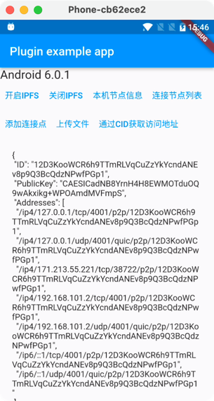

# ipfs_server

一个支持在移动端使用IPFS服务节点的Flutter插件。目前仅支持Android端

## APIs

<b>开启IPFS</b>
 
`Future<bool?> openIPFS()`

<b>关闭IPFS</b>
 
`Future<bool?> closeIPFS() `

<b>当前节点信息</b>
 
`Future<String?> getCurrentIdInfo()`

<b>通过CID获取本地IPFS文件连接</b>
 
`Future<String?> getUrlByCID({required String cid}) `

<b>上传一个文件到IPFS，返回CID</b>
 
`Future<String?> uploadFileToIPFS({required String filePath,}) `

<b>添加节点</b>
 
`Future<bool?> addNode({required String nodeUrl,})`

<b>移除节点</b>
 
`Future<bool?> removeNode({required String nodeUrl,})`

<b>节点列表</b>
 
`Future<List<String>?> nodeList() `

